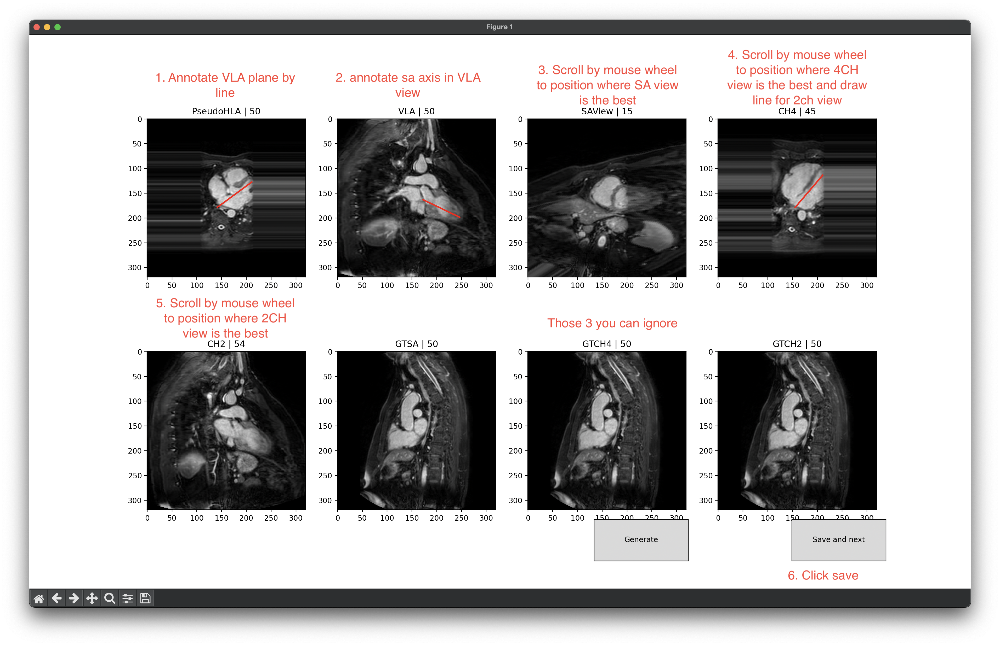
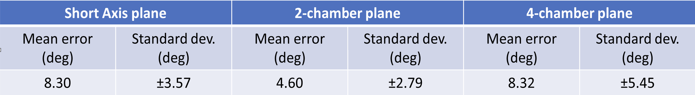
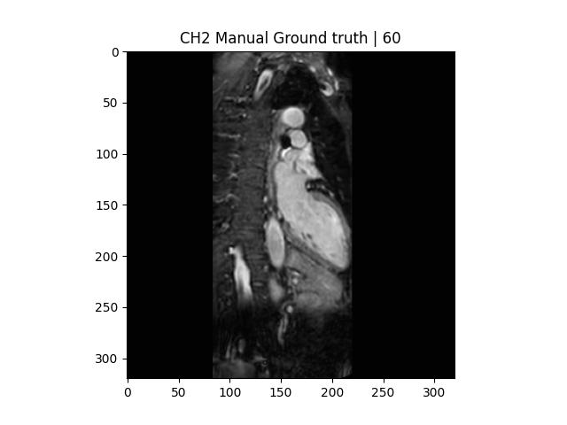
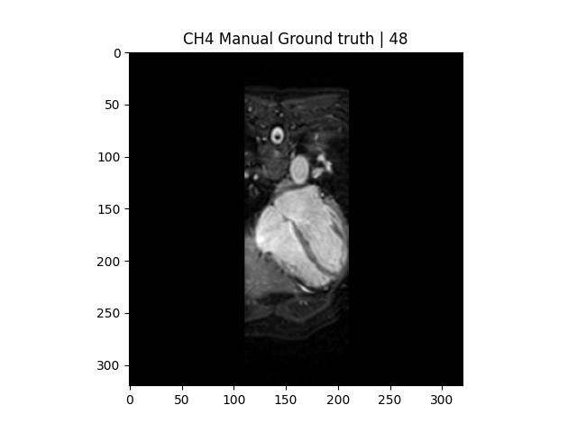
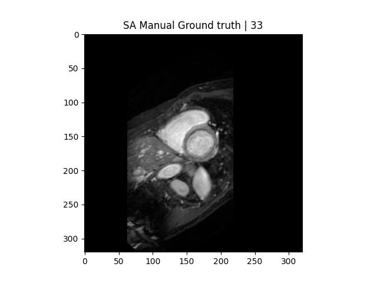

# Introduction
Medical imaging plays a vital role in the diagnosis and treatment of various diseases, including heart diseases. Radiological planes of the heart are used to examine the structure and function of the heart in detail. These planes are usually acquired through various imaging techniques such as Magnetic Resonance Imaging (MRI) and Computed Tomography (CT). However, identification of the correct radiological orientation requires specialized medical knowledge and expertise.

The correct radiological orientation is crucial for accurately interpreting medical images of the heart. When the heart is viewed in the correct orientation, it is easier to identify specific structures and diagnose various cardiac pathologies. For example, the four-chamber view is a crucial view for assessing the function of the heart's chambers and valves. When the heart is not oriented correctly, it can lead to misinterpretation of the image and misdiagnosis. Automatic heart plane inference from 3D data is an important step towards ensuring that medical images are viewed in the correct orientation, which can lead to more accurate diagnoses and better patient outcomes.

#
# Dataset
The publicly available dataset containing 30 sagittal cardiac MR scans has been used. [1]

[1] Tobon-Gomez, Catalina and Geers, Arjan J. and Peters, Jochen and Weese, J{\"{u}}rgen and Pinto, Karen and Karim, Rashed and Ammar, Mohammed and Daoudi, Abdelaziz and Margeta, Jan and Sandoval, Zulma and Stender, Birgit and Zheng, Yefeng and Zuluaga, Maria A. and Betancur, Julian and Ayache, Nicholas and Chikh, Mohammed Amine and Dillenseger, Jean Louis and Kelm, B. Michael and Mahmoudi, Said and Ourselin, Sebastien and Schlaefer, Alexander and Schaeffter, Tobias and Razavi, Reza and Rhode, Kawal S. Benchmark for Algorithms Segmenting the Left Atrium From 3D CT and MRI Datasets


#
# How to [WIP]

First of all. All annotated data and trained networks can be downloaded here:

https://mega.nz/file/P8tVSYAa#IxujOIp-tRpEZk2jP9erI2AgXqMu-0WzrgcV8mGelio

## Annotation
Because of there are no publicly available data that would include annotations of heart radiological planes, we've made our annotation tool that proccess the dataset and alows you to annotate the 4ch, 2ch and SA planes. 

Use it this way:

Expecting that dataset is in this directory stucture:
```
./HeartNet
    /Gomez_T1
        /original
            /a001
            /...
```

```
cd HeartNet
python3 annotate_rotation.py --input './Gomez_T1/original/*/image.mhd' --output ./Gomez_T1/gt
```
Annotate every dataset like this.


This should produce ground truth images in output directory.

#
## Training

If you have data annotated. you can start training like this:
```
python3 rotation.py --batchSz 8 --nEpochs 30 --dataset ./Gomez_T1 --augment 20 --planes sa,ch4,ch2
```

--augment argument tells how many augmented images should be generated from one original
--planes tells which planes should be included in final network head

For more args use --help.

#
## Evaluation
You can download pretrained networks from the link on top.

If you have trained the networks for multishot and singleshot inference you can evaluate results by this command:


python3 evaluate_rotation.py --dataset ./Gomez_T1 --checkpoint rotation_model_sa,ch4,ch2.pth.tar --checkpoint-sa rotation_model_sa.pth.tar --checkpoint-ch4 rotation_model_ch4.pth.tar --checkpoint-ch2 rotation_model_ch2.pth.tar


Evaluation results:



#
Some commetary: Data are split into two categories train/test in proportion 0.75/0.25. Used dataset is very small but with use of data augmentation the results are improved drasticaly.


#
## Results examples:

### 2CH




### 4CH




### SA



